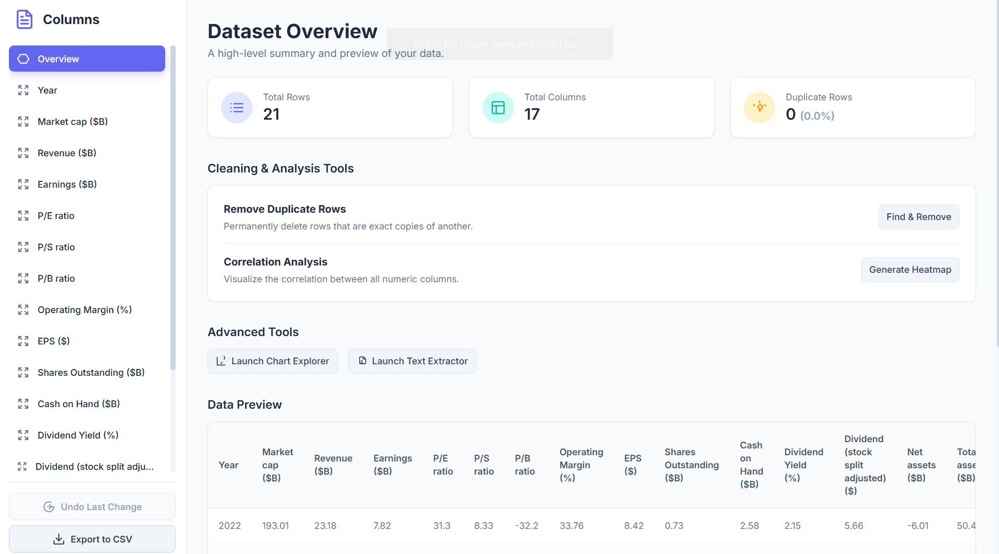
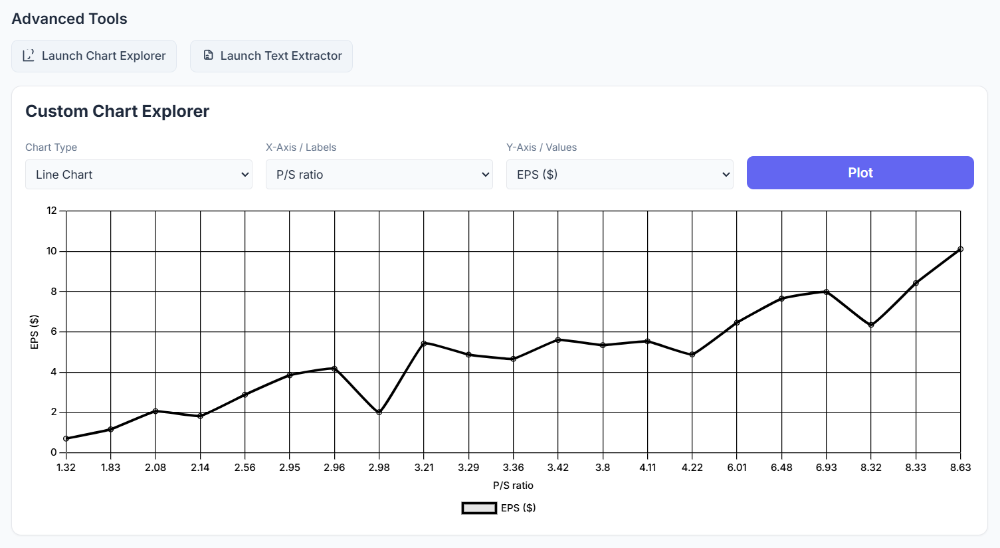
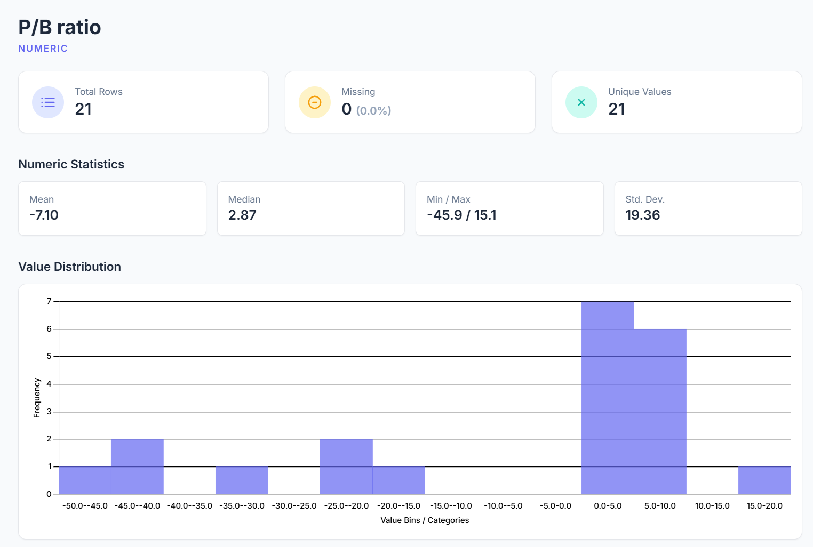
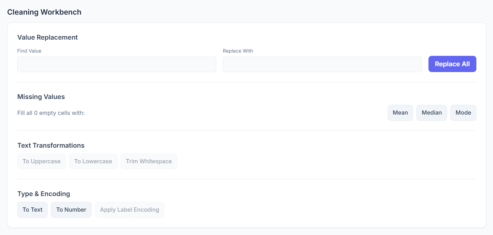

# 📊 Data Inspector: Spreadsheet Tool

[](https://github.com/Iam-PriyanshuGupta/Data-Inspector/stargazers)
[](https://github.com/Iam-PriyanshuGupta/Data-Inspector/issues)
[](https://github.com/Iam-PriyanshuGupta/Data-Inspector/network/members)
[](https://github.com/Iam-PriyanshuGupta/Data-Inspector/blob/main/LICENSE)

An intelligent, browser-based tool for exploring, cleaning, and visualizing CSV datasets.  
This lightweight application provides a powerful suite of features for data analysis **without requiring any installation or backend setup**.  
Just load your data, and start inspecting!

---

## ✨ Live Demo
👉 [Try it here](https://iam-priyanshugupta.github.io/Data-Inspector/)

---

## 🖼️ Preview

### 🔹 Overview Page


### 🔹 Custom Chart Explorer


### 🔹 Column Overview


### 🔹 Cleaning Tools
 

---

## 🔑 Core Features

### 📊 Data Loading & Overview
- **Multiple Loading Options:** Load data from a local `.csv` file, directly from a URL, or via drag-and-drop.  
- **Instant Summary:** See rows, columns, and duplicate entry counts.  
- **Data Preview:** Quickly view the first 10 rows in a clean, scrollable table.  

### 🔬 Detailed Column Analysis
- **Smart Column Detection:** Differentiates Numeric and Categorical columns.  
- **Numeric Stats:** Mean, Median, Min/Max, Std. Deviation.  
- **Categorical Insights:** Count unique values.  
- **Value Distribution:** Histograms for numeric, bar charts for categorical columns.  

### 🧹 Powerful Cleaning Workbench
- **Find & Remove Duplicates**  
- **Find & Replace**  
- **Fill Missing Values (Mean, Median, Mode)**  
- **Text Transformations (UPPERCASE, lowercase, trim whitespace)**  
- **Type Conversion (Text ↔ Number)**  
- **Label Encoding**  

### 🚀 Advanced Tools & Visualization
- **Custom Chart Explorer:** Bar, Scatter, Line, Pie/Doughnut charts.  
- **Text Extractor:** Split text into new columns.  
- **Correlation Heatmap:** Color-coded matrix of numeric correlations (downloadable as PNG).  

### 🛡️ User-Friendly Features
- **Undo Last Change**  
- **Export to CSV**  
- **Responsive Design**  

---

## 🚀 How to Use
1. **Load Your Data:** Upload a CSV, paste a URL, or drag & drop.  
2. **Explore Overview:** Check dataset size, duplicates, and summary.  
3. **Dive into a Column:** Click column names for detailed stats & charts.  
4. **Clean & Transform:** Apply transformations in the cleaning workbench.  
5. **Analyze & Visualize:** Use Chart Explorer, Text Extractor, or Heatmap.  
6. **Export Results:** Download the cleaned dataset as a CSV.  

---

## 🛠️ Technologies Used
- **HTML5, CSS3, Vanilla JavaScript** – Core foundation for a lightweight app.  
- **Tailwind CSS** – Utility-first CSS framework for rapid UI development.  
- **D3.js** – For CSV parsing and data manipulation.  
- **Chart.js** – For interactive charts.  

---

## 💻 How to Run Locally
This project is self-contained and requires no backend or build tools.  

1. Clone or download this repository.  
   ```bash
   git clone https://github.com/Iam-PriyanshuGupta/Data-Inspector.git

## ✍️ Author
This tool was created and developed by Priyanshu Gupta.
